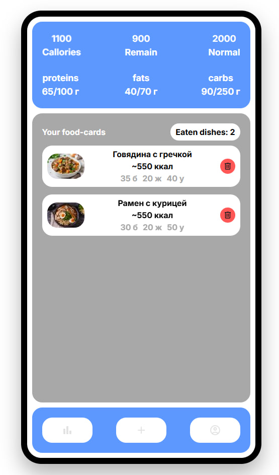

# 🍽️ Food Analyzer

**Food Analyzer** — это веб-приложение для отслеживания питания с помощью фото. Оно позволяет:

- 📸 Загружать фотографии блюд и автоматически анализировать их калории и БЖУ (белки, жиры, углеводы)
- 📊 Вести статистику питания
- 📝 Добавлять и удалять блюда с анимацией карточек
- 💡 Получать рекомендации по сбалансированному рациону

---

## 🚀 Функции

### Основные
- Автоматический подсчёт калорий и БЖУ
- История добавленных блюд
- Сохранение данных в **LocalStorage**
- Красивые анимации добавления и удаления карточек

### Дополнительно
- Миниатюры загружаемых изображений
- Поддержка рекомендаций по рациону
- Адаптивный интерфейс

---

## 🖼️ Скриншоты



---

## 💻 Установка и запуск

1. Клонируйте репозиторий:
```bash
git clone https://github.com/username/food-analyzer.git
```

2.1. Зарегистрируйтесь и войдите в OpenRouter:
```bash
https://openrouter.ai
```
2.2. Создайте собственный API KEY и вставьте его в **script.js** :
```bash
this.openRouterConfig = {
            apiKey: "YOUR_API_KEY",
            ...
        
```
2.3. Сохраните код и запустите приложение
